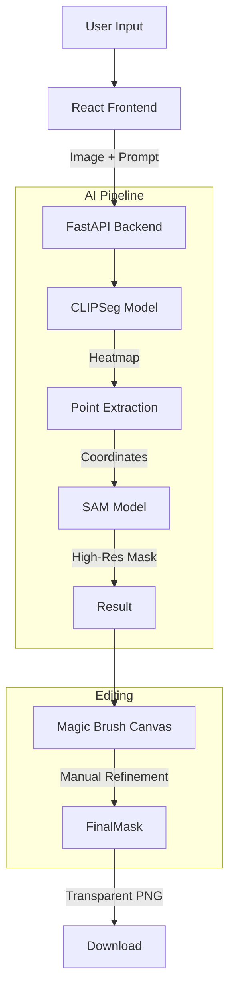

# CLIPSeg AI - Technical Overview v2.0

## System Architecture

The application uses a **Hybrid AI Architecture** combining semantic understanding with geometric precision.



## Core Components

### 1. Hybrid Segmentation Engine
- **CLIPSeg (Transformer)**:
  - Role: "The Brain"
  - Function: Understands text prompts (e.g., "coffee mug") and locates the object roughly.
  - Output: Low-resolution heatmap.
- **SAM (Ultralytics)**:
  - Role: "The Eyes"
  - Function: Takes the location from CLIPSeg and finds the exact object boundaries.
  - Output: High-resolution, crisp binary mask.

### 2. Magic Brush Editor (Frontend)
- **Technology**: HTML5 Canvas API + React Refs.
- **Logic**:
  - Loads the server-generated mask onto a canvas.
  - **Add Mode**: Draws with `globalCompositeOperation = 'source-over'`.
  - **Subtract Mode**: Draws with `globalCompositeOperation = 'destination-out'`.
  - **Save**: Exports canvas to Base64 PNG.

### 3. GPU Acceleration
- **Implementation**:
  - Auto-detects `torch.cuda.is_available()`.
  - Moves `model`, `processor`, and `inputs` to `cuda` device.
  - Fallback to `cpu` if no GPU found.

## API Specification v2.0

### `POST /segment`

**Parameters:**
- `image`: File
- `prompt`: String
- `threshold`: Float (0.1 - 0.9)
- `use_sam`: Boolean (True = Enable Hybrid Mode)
- `visualization`: String ("all", "transparent", etc.)

**Response:**
```json
{
  "success": true,
  "visualizations": {
    "overlay": "base64...",
    "mask": "base64...",
    "transparent": "base64..."
  }
}
```

## Performance

| Mode | Device | Latency |
|------|--------|---------|
| Standard (CLIPSeg) | CPU | ~3.0s |
| Standard (CLIPSeg) | GPU | ~0.1s |
| High Precision (SAM) | CPU | ~5.0s |
| High Precision (SAM) | GPU | ~0.3s |

## Future Roadmap

See [UPGRADE_GUIDE.md](UPGRADE_GUIDE.md) for planned features like:
- Batch processing
- Inpainting (Generative Fill)
- Multi-object segmentation
